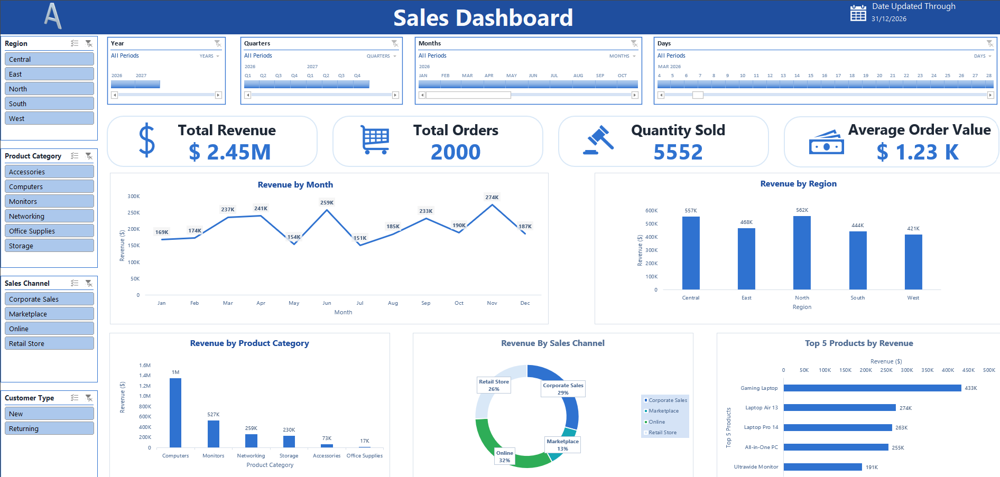

# 📊 Interactive Sales Dashboard | Microsoft Excel

An interactive sales analytics dashboard built using **Microsoft Excel** to monitor sales performance, analyze revenue trends, and uncover insights across regions, sales channels, product categories, and customer segments.

## 📌 Project Overview

This project transforms raw sales transaction data into an interactive, visual dashboard that helps users understand business performance and make data-driven decisions.

The dashboard combines KPI summaries, charts, and PivotTable-based analysis to provide a consolidated view of sales performance in an easy-to-understand format.

## 🎯 Project Objectives

- Monitor overall sales performance using key performance indicators.
- Analyze monthly revenue trends and sales distribution.
- Compare sales performance across geographical regions.
- Evaluate revenue contribution by product category.
- Understand sales channel performance.
- Explore customer segments and product-level sales data.
- Present business insights through an interactive dashboard.

## 📈 Dashboard Preview

The dashboard contains visualizations designed to summarize important sales metrics and business trends.

**Key highlights:**
- Revenue and order performance overview
- Monthly sales trend analysis
- Regional sales comparison
- Product category performance
- Sales channel contribution
- Interactive exploration of sales data

> **Preview:** Add a screenshot of your dashboard to your repository and update the image path below.



## 🔑 Key Performance Indicators (KPIs)

The dashboard includes the following metrics:

| KPI | Description |
|---|---|
| **Total Revenue** | Total revenue generated from sales transactions |
| **Total Orders** | Number of recorded orders |
| **Total Quantity Sold** | Total units sold across all orders |
| **Average Revenue per Order** | Average revenue generated per order |

### Sample Dataset Summary

The supplied workbook contains the following overall figures in its PivotTable summaries:

| Metric | Value |
|---|---:|
| Total Revenue | 2,452,084.30 |
| Total Orders | 2,000 |
| Total Quantity Sold | 5,552 |
| Average Revenue per Order | 1,226.04 |

*Note: These figures represent the current workbook summary and may change if the underlying dataset or PivotTables are updated.*

## 📊 Dashboard Features

### 1. Monthly Sales Analysis
- Tracks revenue across different months.
- Helps identify sales fluctuations and seasonal patterns.
- Supports the evaluation of monthly business performance.

### 2. Regional Performance Analysis
- Compares revenue across geographical regions.
- Highlights differences in regional sales contributions.
- Helps identify stronger-performing and underperforming markets.

### 3. Product Category Analysis
- Evaluates revenue generated by different product categories.
- Helps identify key contributors to overall sales.
- Supports product portfolio analysis.

### 4. Sales Channel Analysis
- Compares performance across sales channels, including online, retail store, marketplace, and corporate sales.
- Helps assess the contribution of different distribution channels.

### 5. Customer and Product Analysis
- Supports analysis of new and returning customers.
- Provides product-level sales information.
- Enables further investigation of sales patterns using the underlying transaction data.

### 6. Interactive Reporting
- Uses Excel dashboard visualizations and PivotTable-based analysis.
- Enables users to explore business performance interactively using the controls available in the workbook.
- Consolidates multiple sales perspectives into a single reporting interface.

## 🗂️ Dataset Description

The workbook contains three worksheets:

| Worksheet | Purpose |
|---|---|
| `Sales_Dashboard` | Main dashboard containing visualizations |
| `Sales_Data` | Raw sales transaction data |
| `pivots` | Supporting PivotTables used for analysis |

The `Sales_Data` worksheet contains **2,000 sales records** and the following fields:

| Column | Description |
|---|---|
| `Order ID` | Unique identifier for an order |
| `Date` | Date of the transaction |
| `Region` | Geographical sales region |
| `Sales Channel` | Channel through which the sale occurred |
| `Customer Type` | New or returning customer |
| `Product Category` | Category of the product sold |
| `Product` | Name of the product |
| `Salesperson` | Person responsible for the sale |
| `Quantity` | Number of units sold |
| `Unit Price` | Price per unit |
| `Discount` | Discount applied to the transaction |
| `Revenue` | Revenue generated from the transaction |

## 🛠️ Tools and Technologies

- **Microsoft Excel** — Dashboard creation and data analysis
- **PivotTables** — Data aggregation and multidimensional analysis
- **PivotCharts / Excel Charts** — Visual representation of sales trends and comparisons
- **Excel Formulas** — Revenue and KPI calculations
- **Interactive Excel Controls** — Exploration of dashboard data, where configured

## ⚙️ How to Use the Dashboard

1. Download or clone this repository.
2. Open `Sale_excel_dashb.xlsx` in Microsoft Excel.
3. Navigate to the `Sales_Dashboard` worksheet.
4. Review the KPI summaries and visualizations.
5. Use the available interactive controls to explore the data.
6. Navigate to `Sales_Data` to inspect the underlying transactions.
7. If the source data is modified, refresh the relevant PivotTables and charts to update the dashboard.

**Recommended:** Use the desktop version of Microsoft Excel for the best compatibility with interactive workbook features.

## 💡 Business Value

This dashboard demonstrates how spreadsheet-based business intelligence can simplify sales reporting and performance monitoring.

It helps users:
- Identify revenue trends and sales patterns.
- Compare regional and channel performance.
- Understand product category contributions.
- Monitor order volume and sales quantities.
- Support data-driven business decisions.
- Convert raw transactional data into actionable insights.

## 🚀 Future Improvements

Potential enhancements for this project include:

- Adding year-over-year and month-over-month growth calculations.
- Introducing profit and profit-margin analysis.
- Adding salesperson performance rankings.
- Implementing advanced slicers and date-based filters.
- Building a sales forecasting model.
- Recreating the dashboard in Power BI for enhanced reporting capabilities.
- Automating data imports and dashboard refresh workflows.

## 📁 Repository Structure

```text
Interactive-Sales-Dashboard/
├── Sale_excel_dashb.xlsx
├── README.md
└── sales_dashboard.png
```

*The `dashboard_preview.png` file is an optional dashboard screenshot that you can add to the repository.*

## 📚 Skills Demonstrated

- Data analysis and interpretation
- Microsoft Excel dashboard development
- Data visualization
- KPI reporting
- PivotTable-based analysis
- Sales performance analysis
- Business intelligence and reporting
- Analytical thinking and data-driven decision-making


⭐ If you find this project useful, consider giving the repository a star!

*Built with Microsoft Excel to transform sales data into meaningful business insights.*

